# BeatVegas API Flow Documentation
## Complete Request/Response Sequences & Data Flow

**Version**: 1.0.0-mvp  
**Last Updated**: 2025-11-08  
**Status**: Production

---

## Table of Contents

1. [Architecture Overview](#1-architecture-overview)
2. [Complete Data Pipeline](#2-complete-data-pipeline)
3. [Endpoint Specifications](#3-endpoint-specifications)
4. [Error Handling](#4-error-handling)
5. [Performance Characteristics](#5-performance-characteristics)
6. [OmniCore Integration](#6-omnicore-integration)

---

## 1. Architecture Overview

### 1.1 System Components


---

## 2. Complete Data Pipeline

### 2.1 End-to-End Flow


### 2.2 Data Transformation Pipeline


---

## 3. Endpoint Specifications

### 3.1 Fetch Odds Endpoint

**Endpoint**: `GET /api/core/fetch-odds`


**Request**:
```http
GET /api/core/fetch-odds?sport=basketball_nba&region=us&markets=h2h,spreads HTTP/1.1
Host: api.beatvegas.com
X-API-Key: your_api_key
Accept: application/json
```

**Response (Success)**:
```json
{
  "status": "ok",
  "timestamp": "2025-11-08T12:00:00.000Z",
  "count": 14,
  "meta": {
    "sport": "basketball_nba",
    "region": "us",
    "markets": ["h2h", "spreads"],
    "source": "odds_api_v4"
  }
}
```

**Response (Error)**:
```json
{
  "status": "error",
  "timestamp": "2025-11-08T12:00:00.000Z",
  "error": {
    "code": "ODDS_API_ERROR",
    "message": "The Odds API returned 401: Invalid API key",
    "details": "Check ODDS_API_KEY environment variable"
  }
}
```

---

### 3.2 Normalize Endpoint

**Endpoint**: `POST /api/core/normalize`


**Request**:
```http
POST /api/core/normalize?limit=10 HTTP/1.1
Host: api.beatvegas.com
X-API-Key: your_api_key
Content-Type: application/json
```

**Response**:
```json
{
  "status": "ok",
  "timestamp": "2025-11-08T12:01:00.000Z",
  "normalized": [
    {
      "event_id": "abc123def456",
      "sport_key": "basketball_nba",
      "teams": ["Los Angeles Lakers", "Boston Celtics"],
      "odds": [
        {
          "bookmaker": "fanduel",
          "market": "h2h",
          "name": "Los Angeles Lakers",
          "price": 2.10,
          "point": null
        },
        {
          "bookmaker": "fanduel",
          "market": "spreads",
          "name": "Los Angeles Lakers",
          "price": 1.91,
          "point": -5.5
        }
      ],
      "confidence": 0.45,
      "timestamp": "2025-11-08T12:01:00.000Z",
      "source": "odds_api_v4",
      "version": "1.0.0"
    }
  ]
}
```

---

### 3.3 Run Permutations Endpoint

**Endpoint**: `POST /api/core/run-permutations`

```mermaid
sequenceDiagram
    participant Client
    participant FastAPI
    participant Permuter
    participant Logger
    participant MongoDB
    
    Client->>FastAPI: POST /run-permutations?event_id=abc123&max_legs=2&top_n=5
    
    FastAPI->>MongoDB: find_events("normalized_data", {event_id: "abc123"})
    
    alt Event Found
        MongoDB-->>FastAPI: Normalized event
        FastAPI->>Permuter: run_permutations(odds, max_legs=2, top_n=5)
        
        Note over Permuter: Generate all combinations
        Permuter->>Permuter: generate_combinations(odds, 2)
        Note over Permuter: C(n,2) = n!/(2!(n-2)!)
        
        Note over Permuter: Score each combination
        loop For each combination
            Permuter->>Permuter: score_combination(combo)
        end
        
        Note over Permuter: Sort and select top N
        Permuter->>Permuter: sort_by_score()
        Permuter->>Permuter: select_top_n(5)
        
        Permuter-->>FastAPI: Top 5 permutations
        FastAPI->>Logger: log_stage("permutations", "generated", {event_id, count: 5})
        FastAPI-->>Client: 200 {permutations: [...]}
        
    else Event Not Found
        MongoDB-->>FastAPI: Empty result
        FastAPI-->>Client: 404 {detail: "Normalized event not found"}
    end
```



**Request**:
```http
POST /api/core/run-permutations?event_id=abc123def456&max_legs=2&top_n=5 HTTP/1.1
Host: api.beatvegas.com
X-API-Key: your_api_key
```

**Response**:
```json
{
  "status": "ok",
  "timestamp": "2025-11-08T12:02:00.000Z",
  "event_id": "abc123def456",
  "permutations": [
    {
      "combo": [
        {
          "bookmaker": "fanduel",
          "market": "h2h",
          "name": "Los Angeles Lakers",
          "price": 2.10,
          "point": null
        },
        {
          "bookmaker": "draftkings",
          "market": "spreads",
          "name": "Boston Celtics",
          "price": 1.90,
          "point": 5.5
        }
      ],
      "score": 0.0399
    }
  ],
  "meta": {
    "total_combinations": 45,
    "returned": 5,
    "algorithm": "naive_v1.0"
  }
}
```

---

### 3.4 Predict Endpoint

**Endpoint**: `POST /api/core/predict`


**Request**:
```http
POST /api/core/predict?event_id=abc123def456 HTTP/1.1
Host: api.beatvegas.com
X-API-Key: your_api_key
```

**Response**:
```json
{
  "status": "ok",
  "timestamp": "2025-11-08T12:03:00.000Z",
  "event_id": "abc123def456",
  "predictions": [
    {
      "combo": [
        {
          "bookmaker": "fanduel",
          "market": "h2h",
          "name": "Los Angeles Lakers",
          "price": 2.10,
          "point": null
        }
      ],
      "base_score": 0.210,
      "adjusted_confidence": 0.354,
      "model_version": "stub_v1.0",
      "prediction_id": "pred_abc123_001"
    }
  ],
  "meta": {
    "base_confidence": 0.45,
    "algorithm": "omniedge_stub_v1.0",
    "processed_at": "2025-11-08T12:03:00.000Z"
  }
}
```

---

### 3.5 Logs Endpoint

**Endpoint**: `GET /api/core/logs`


**Request**:
```http
GET /api/core/logs?module=predict&level=INFO&limit=10 HTTP/1.1
Host: api.beatvegas.com
X-API-Key: admin_api_key
X-Admin-Token: jwt_token_here
```

**Response**:
```json
{
  "status": "ok",
  "timestamp": "2025-11-08T12:04:00.000Z",
  "count": 10,
  "logs": [
    {
      "log_id": "log_uuid_001",
      "module": "predict",
      "stage": "enhanced",
      "level": "INFO",
      "timestamp": "2025-11-08T12:03:30.123Z",
      "request_id": "req_abc123",
      "input": {
        "event_id": "abc123def456",
        "permutation_count": 5
      },
      "output": {
        "prediction_count": 5,
        "avg_confidence": 0.354
      },
      "performance": {
        "duration_ms": 245.3,
        "memory_mb": 38.2
      }
    }
  ]
}
```

---

## 4. Error Handling

### 4.1 Error Response Format


### 4.2 Standard Error Schema

```json
{
  "status": "error",
  "timestamp": "2025-11-08T12:00:00.000Z",
  "error": {
    "code": "ERROR_CODE",
    "message": "Human-readable error message",
    "details": "Additional context or troubleshooting info",
    "request_id": "req_abc123",
    "trace_id": "trace_xyz789"
  }
}
```

### 4.3 Error Codes

| Code | HTTP Status | Description |
|------|-------------|-------------|
| `VALIDATION_ERROR` | 400 | Invalid request parameters |
| `AUTH_REQUIRED` | 401 | Authentication required |
| `FORBIDDEN` | 403 | Insufficient permissions |
| `NOT_FOUND` | 404 | Resource not found |
| `RATE_LIMIT_EXCEEDED` | 429 | Too many requests |
| `ODDS_API_ERROR` | 502 | The Odds API failure |
| `DATABASE_ERROR` | 500 | MongoDB connection/query failure |
| `TIMEOUT` | 504 | Operation timeout |
| `INTERNAL_ERROR` | 500 | Unexpected server error |

---

## 5. Performance Characteristics

### 5.1 Latency Breakdown


### 5.2 Throughput Benchmarks

| Endpoint | Concurrent Users | Requests/sec | Avg Latency | p99 Latency |
|----------|------------------|--------------|-------------|-------------|
| fetch-odds | 10 | 8 req/s | 1.2s | 1.8s |
| normalize | 50 | 52 req/s | 150ms | 280ms |
| run-permutations | 100 | 98 req/s | 78ms | 145ms |
| predict | 40 | 38 req/s | 245ms | 420ms |
| logs | 200 | 195 req/s | 48ms | 95ms |

---

## 6. OmniCore Integration

### 6.1 OmniCore Ingestion Flow


### 6.2 Log Stream Format (NDJSON)

**Endpoint**: `POST /omnicore/logs/normalized`

**Format**: Newline-delimited JSON (one JSON object per line)

```json
{"log_id":"log_001","module":"normalize","timestamp":"2025-11-08T12:00:00.000Z","input":{...},"output":{...}}
{"log_id":"log_002","module":"predict","timestamp":"2025-11-08T12:00:01.000Z","input":{...},"output":{...}}
```

### 6.3 OmniCore Naming Conventions

**Module Identifiers**:
```
omni.data.ingestion.beatvegas_odds
omni.data.normalization.sports_canonical
omni.ai.permutation.parlay_v1
omni.ai.prediction.omniedge_sports_v2
```

**Event Types**:
```
beatvegas.odds.fetched
beatvegas.data.normalized
beatvegas.permutation.generated
beatvegas.prediction.enhanced
```

---

## 7. API Versioning Strategy

### 7.1 Version Lifecycle


### 7.2 Version Headers

**Request**:
```http
GET /api/core/fetch-odds HTTP/1.1
X-API-Version: v1
X-Schema-Version: 1.0.0
```

**Response**:
```http
HTTP/1.1 200 OK
X-API-Version: v1
X-Schema-Version: 1.0.0
X-Deprecated: false
```

---

## Appendix A: cURL Examples

### Fetch Odds
```bash
curl -X GET "https://api.beatvegas.com/api/core/fetch-odds?sport=basketball_nba&region=us&markets=h2h,spreads" \
  -H "X-API-Key: your_api_key"
```

### Normalize Data
```bash
curl -X POST "https://api.beatvegas.com/api/core/normalize?limit=10" \
  -H "X-API-Key: your_api_key"
```

### Run Permutations
```bash
curl -X POST "https://api.beatvegas.com/api/core/run-permutations?event_id=abc123&max_legs=2&top_n=5" \
  -H "X-API-Key: your_api_key"
```

### Generate Predictions
```bash
curl -X POST "https://api.beatvegas.com/api/core/predict?event_id=abc123" \
  -H "X-API-Key: your_api_key"
```

### View Logs
```bash
curl -X GET "https://api.beatvegas.com/api/core/logs?module=predict&limit=10" \
  -H "X-API-Key: admin_api_key" \
  -H "X-Admin-Token: jwt_token"
```

---

## Appendix B: Postman Collection

See `postman/BeatVegas_MVP.postman_collection.json` for complete collection.

---

**Document Version**: 1.0.0  
**Last Updated**: 2025-11-08  
**Maintained By**: BeatVegas Engineering Team

**END OF DOCUMENT**
